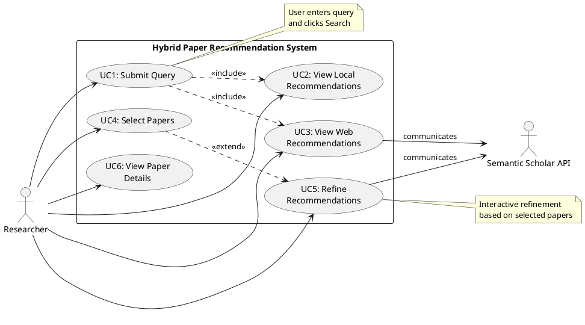
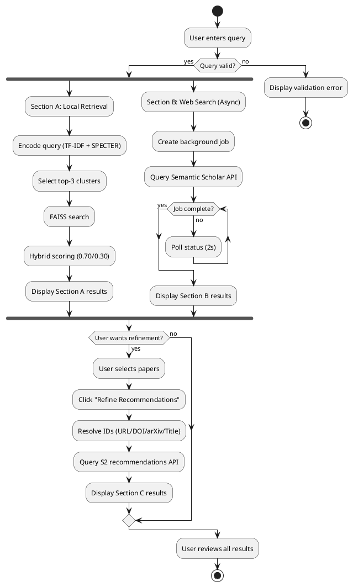
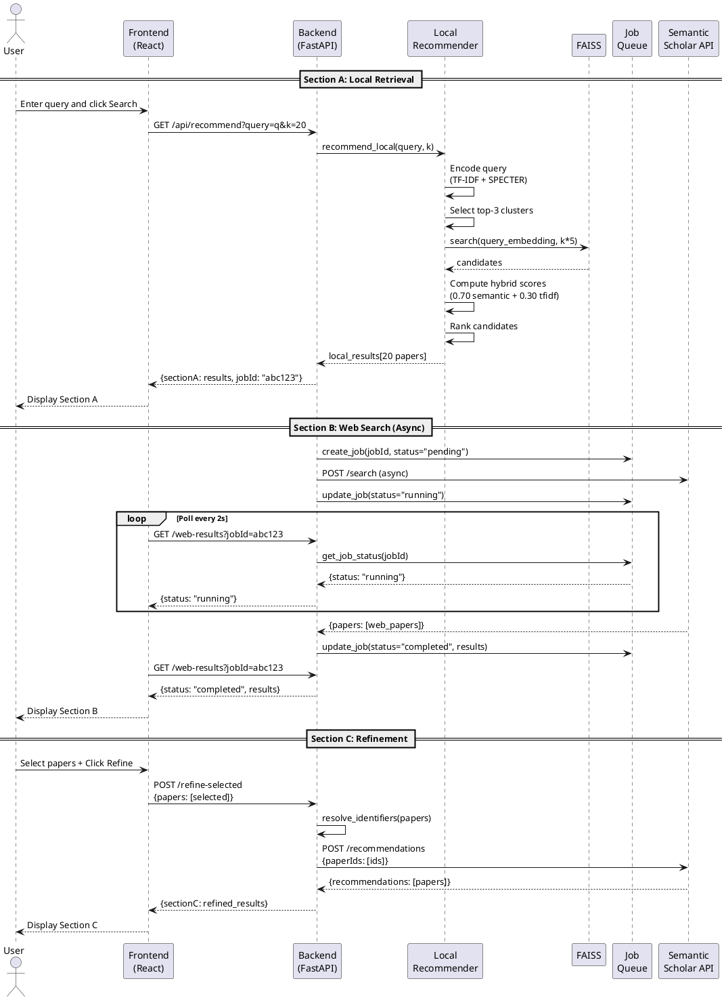

# Complete Diagram Specifications for BE Project Report

## Quick Links
- PlantUML Online Editor: https://www.plantuml.com/plantuml/uml/
- Draw.io Online: https://app.diagrams.net/
- Alternative: Lucidchart, PowerPoint, Google Slides

---

## 1. System Architecture Diagram (system_architecture.png)

**Tool:** Draw.io, PlantUML, or PowerPoint
**Size:** Landscape, 1920x1400px or A4 landscape
**Purpose:** Show complete system with offline/online pipelines, three tiers, and data flow
**Style:** Module-based, technology-agnostic (NO specific tech stack names)

### Design Philosophy:
- ✅ **Use functional/module names** (e.g., "Query Interface" instead of "React + Vite")
- ✅ **Abstract technology details** (e.g., "Local Retrieval Engine" instead of "TF-IDF + SPECTER")
- ✅ **Focus on architecture patterns** (sync/async, tiers, data flow)
- ❌ **Avoid** specific frameworks, libraries, port numbers, dimensions

### Structure:

```
┌─────────────────────────────────────────────────────────────────┐
│                 OFFLINE PROCESSING PIPELINE                      │
├─────────────────────────────────────────────────────────────────┤
│                                                                   │
│  [Paper Corpus] → [Data Ingestion] → [Text Preprocessing]       │
│       → [Feature Extraction] → [Clustering Engine]              │
│       → [Index Builder]                                          │
│                                                                   │
└─────────────────────────────────────────────────────────────────┘

┌─────────────────────────────────────────────────────────────────┐
│                 ONLINE PROCESSING PIPELINE                       │
├─────────────────────────────────────────────────────────────────┤
│                                                                   │
│  ┌─────────────────────┐                                        │
│  │ PRESENTATION LAYER  │  [Researcher] ←→ [Query Interface]    │
│  │     (Tier 1)        │                  [Results Display]     │
│  │                     │                  [Interaction Handler] │
│  └──────────┬──────────┘                                        │
│             │                                                    │
│  ┌──────────▼──────────────────────────────────────────────┐   │
│  │ APPLICATION LAYER (Tier 2)                              │   │
│  │                                                          │   │
│  │  [Query Orchestrator]                                   │   │
│  │         ├──────────┬──────────┐                         │   │
│  │         ▼          ▼          ▼                          │   │
│  │   [Local      [Web        [Refinement                   │   │
│  │   Retrieval]  Discovery]  Engine]                       │   │
│  │   Path A      Path B      Path C                        │   │
│  │   (Sync)      (Async)     (Sync)                        │   │
│  └──────────┬──────────────────────────────────────────────┘   │
│             │                                                    │
│  ┌──────────▼──────────────────────────────────────────────┐   │
│  │ DATA LAYER (Tier 3)                                     │   │
│  │                                                          │   │
│  │  [Offline Data Store]  [Job Queue]  [External Data      │   │
│  │                                       Connector]         │   │
│  │         ↓                                  ↓             │   │
│  │  (References Offline Pipeline)    [External Paper DB]   │   │
│  └──────────────────────────────────────────────────────────┘   │
└─────────────────────────────────────────────────────────────────┘
```

### Module Descriptions:

**OFFLINE PIPELINE:**
- Paper Corpus: Source data repository
- Data Ingestion: Loads and validates papers
- Text Preprocessing: Cleans and normalizes text
- Feature Extraction: Generates representations (lexical + semantic)
- Clustering Engine: Groups similar papers
- Index Builder: Creates optimized search structures

**ONLINE PIPELINE - TIER 1 (Presentation):**
- Query Interface: User input component
- Results Display: Output visualization
- Interaction Handler: Selection and refinement UI

**ONLINE PIPELINE - TIER 2 (Application):**
- Query Orchestrator: Routes and coordinates requests
- Local Retrieval Engine: Hybrid search on local corpus (Path A - Sync)
- Web Discovery Engine: Asynchronous external search (Path B - Async)
- Refinement Engine: Interactive recommendation refinement (Path C - Sync)

**ONLINE PIPELINE - TIER 3 (Data):**
- Offline Data Store: Pre-computed indices and models
- Job Queue: Manages asynchronous tasks
- External Data Connector: Interface to external APIs

### Draw.io Instructions:
**See detailed instructions in:** `diagrams/DRAW_IO_INSTRUCTIONS_MODULAR.md`

**Quick summary:**
1. Use rounded rectangles for all modules (NOT tech stack labels)
2. Use cylinders ONLY for databases/storage
3. Use cloud shape for external services
4. Color code by layer: Blue (Presentation), Green (Application), Yellow (Data), Orange (External)
5. Show clear data flow with labeled arrows
6. Add "Path A/B/C" labels for processing flows
7. Include dashed arrow from offline pipeline to data layer

### PlantUML Alternative:
**See:** `diagrams/system_architecture_modular.puml` for component diagram version

---

## 2. Use Case Diagram (use_case_diagram.png)

**Tool:** PlantUML
**Format:** Standard UML Use Case Diagram

### PlantUML Code:



**Alternative Draw.io Instructions:**
1. Actor (stick figure) on left: "Researcher"
2. Actor on right: "Semantic Scholar API"
3. Large oval boundary labeled "Hybrid Paper Recommendation System"
4. Inside: 6 ovals for use cases (UC1-UC6)
5. Solid arrows from Researcher to use cases
6. Dashed arrows for <<include>> and <<extend>> relationships
7. Solid arrows from UC3 and UC5 to S2 API

---

## 3. Data Flow Diagram - Level 0 (dfd_level0.png)

**Tool:** Draw.io
**Format:** Standard DFD notation

### Structure:

```
┌─────────────┐
│ Researcher  │ (Square - External Entity)
└──────┬──────┘
       │ Query
       ↓
   ┌───────────────────────────────┐
   │                               │
   │  Hybrid Paper                 │ (Circle/Rounded Rectangle)
   │  Recommendation System        │
   │                               │
   └───────────┬───────────────────┘
               │ Recommendations
               ↓
       ┌───────────────┐
       │  Researcher   │
       └───────────────┘

Connected to:
┌──────────────────────┐
│ Semantic Scholar API │ (Square - External Entity)
└──────────────────────┘
       ↑          │
       │ Request  │ Response
       │          ↓
   (System)
```

### Major Processes Inside System (Level 1):

```
P1: Local Hybrid Retrieval
  Input: Query
  Output: Ranked local recommendations
  Data Stores: TF-IDF, SPECTER, FAISS, Clusters

P2: Web Discovery
  Input: Query
  Output: Ranked web recommendations
  External: S2 API

P3: Identifier Resolution
  Input: Paper metadata
  Output: S2 paper ID
  External: S2 API

P4: Refinement
  Input: Selected paper IDs
  Output: Refined recommendations
  External: S2 API

Data Stores (parallel lines):
DS1: arXiv Corpus
DS2: TF-IDF Vectorizer
DS3: SPECTER Embeddings
DS4: K-Means Model
DS5: FAISS Indices
DS6: Job Queue
```

### Draw.io Instructions:
1. External entities: Rectangles (Researcher, S2 API)
2. Processes: Circles or rounded rectangles (P1-P4)
3. Data stores: Open rectangles (parallel lines on left) (DS1-DS6)
4. Data flows: Labeled arrows
5. Use DFD color scheme: External entities (gray), Processes (blue), Data stores (green)

---

## 4. Activity Diagram (activity_diagram.png)

**Tool:** PlantUML
**Format:** UML Activity Diagram

### PlantUML Code:



**Alternative Draw.io Instructions:**
1. Start node (filled circle)
2. Activities (rounded rectangles)
3. Decision diamonds (Query valid?, User wants refinement?, Job complete?)
4. Fork/Join bars (thick horizontal lines) for parallel Section A/B
5. Arrows showing flow
6. End node (filled circle with border)
7. Use swimlanes if showing different components

---

## 5. Sequence Diagram (sequence_diagram.png)

**Tool:** PlantUML
**Format:** UML Sequence Diagram

### PlantUML Code:



---

## 6. Functional Decomposition Diagram (functional_decomposition.png)

**Tool:** Draw.io or PowerPoint
**Format:** Hierarchical tree structure

### Structure:

```
                    ┌─────────────────────────────┐
                    │ Hybrid Paper Recommendation │
                    │          System             │
                    └──────────────┬──────────────┘
                                   │
            ┌──────────────────────┼──────────────────────┐
            │                      │                      │
    ┌───────▼────────┐   ┌────────▼────────┐   ┌────────▼────────┐
    │    Offline     │   │   Query         │   │  Web            │
    │   Processing   │   │  Processing     │   │ Integration     │
    └────────┬───────┘   └────────┬────────┘   └────────┬────────┘
             │                    │                      │
    ┌────────┼────────┐   ┌───────┼───────┐    ┌────────┼────────┐
    │        │        │   │       │       │    │        │        │
┌───▼──┐ ┌──▼───┐ ┌──▼─┐ │   ┌───▼──┐ ┌─▼──┐ │   ┌────▼───┐ ┌──▼────┐
│Data  │ │TF-IDF│ │SPEC│ │   │Query │ │Clus│ │   │S2 API  │ │ID     │
│Loader│ │      │ │TER │ │   │Encode│ │ter │ │   │Client  │ │Resolve│
└──────┘ └──────┘ └────┘ │   │      │ │Sel.│ │   └────────┘ └───────┘
                          │   └──────┘ └────┘ │
                    ┌─────▼──────┐   ┌────▼────┐
                    │K-Means     │   │Hybrid   │
                    │Clustering  │   │Scorer   │
                    └────────────┘   └─────────┘
                    ┌──────────┐
                    │FAISS     │
                    │Index     │
                    └──────────┘

                    ┌─────────────────┐
                    │  User Interface │
                    └────────┬────────┘
                             │
                    ┌────────┼────────┐
                    │        │        │
              ┌─────▼───┐ ┌──▼────┐ ┌▼─────────┐
              │Query    │ │Result │ │Selection │
              │Input    │ │Display│ │Manager   │
              └─────────┘ └───────┘ └──────────┘
```

### Draw.io Instructions:
1. Top-level box: System name
2. Level 1: 4 subsystems (rectangles)
3. Level 2: Components within each subsystem
4. Use hierarchical tree layout
5. Connect with lines (not arrows)
6. Color code by subsystem: Blue (offline), Green (query), Orange (web), Purple (UI)

---

## 7. PERT Diagram (pert_diagram.png)

**Tool:** Draw.io or PowerPoint
**Format:** PERT Network Diagram

### Structure (Critical Path):

```
Your PERT Table:
T1: Literature Survey (4 weeks) - No dependency
T2: Data Preprocessing (4 weeks) - Depends on T1
T3: Feature Extraction (3 weeks) - Depends on T2
T4: Clustering (2 weeks) - Depends on T3
T5: Indexing (2 weeks) - Depends on T4
T6: Recommendation Engine (3 weeks) - Depends on T5
T7: Testing (2 weeks) - Depends on T6
Total: 20 weeks

Critical Path: T1 → T2 → T3 → T4 → T5 → T6 → T7
```

### PERT Diagram Layout:

```
    ┌─────────┐
    │   T1    │
    │Lit.Survey│
    │ 4 weeks │
    └────┬────┘
         │
    ┌────▼────┐
    │   T2    │
    │Data Prep│
    │ 4 weeks │
    └────┬────┘
         │
    ┌────▼────┐
    │   T3    │
    │Feature  │
    │Extract  │
    │ 3 weeks │
    └────┬────┘
         │
    ┌────▼────┐
    │   T4    │
    │Clustering│
    │ 2 weeks │
    └────┬────┘
         │
    ┌────▼────┐
    │   T5    │
    │Indexing │
    │ 2 weeks │
    └────┬────┘
         │
    ┌────▼────┐
    │   T6    │
    │Rec.Engine│
    │ 3 weeks │
    └────┬────┘
         │
    ┌────▼────┐
    │   T7    │
    │Testing  │
    │ 2 weeks │
    └─────────┘

Cumulative timeline on right:
Week 0  → T1 Start
Week 4  → T1 End, T2 Start
Week 8  → T2 End, T3 Start
Week 11 → T3 End, T4 Start
Week 13 → T4 End, T5 Start
Week 15 → T5 End, T6 Start
Week 18 → T6 End, T7 Start
Week 20 → T7 End (Project Complete)
```

### Draw.io Instructions for PERT:
1. Use rounded rectangles for tasks
2. Inside each box: Task ID, Name, Duration
3. Connect with thick arrows (bold, red for critical path)
4. Add milestone markers (diamonds) at key points
5. Show cumulative timeline on the side
6. Highlight critical path in RED
7. All tasks are on critical path (slack = 0)

---

## How to Create the Diagrams

### Method 1: PlantUML (for UML diagrams)
1. Go to https://www.plantuml.com/plantuml/uml/
2. Paste the PlantUML code
3. Click "Submit"
4. Download as PNG
5. Use for: Use Case, Sequence, Activity diagrams

### Method 2: Draw.io (for all diagrams)
1. Go to https://app.diagrams.net/
2. Create new diagram
3. Follow the specifications above
4. Use proper shapes:
   - Rectangles: Components, processes
   - Rounded rectangles: Activities, tasks
   - Cylinders: Data stores
   - Actors: Stick figures (for use case)
   - Diamonds: Decisions
   - Arrows: Data flow / control flow
5. Export as PNG (300 DPI recommended)

### Method 3: PowerPoint/Google Slides
1. Use SmartArt for hierarchical diagrams (Functional Decomposition)
2. Use Shapes → Flowchart for DFD, Activity
3. Use Shapes → Basic for PERT, Architecture
4. Export slides as high-resolution PNG

---

## Color Schemes Recommended

**System Architecture:**
- Frontend: Light Blue (#E3F2FD)
- Backend: Light Green (#E8F5E9)
- Data: Light Yellow (#FFF9C4)
- External: Light Gray (#EEEEEE)

**UML Diagrams:**
- Actors: No fill, black outline
- Use cases: White fill, black outline
- System boundary: Light gray (#F5F5F5)
- Relationships: Black dashed/solid lines

**DFD:**
- External entities: Light gray (#E0E0E0)
- Processes: Light blue (#BBDEFB)
- Data stores: Light green (#C8E6C9)
- Data flows: Black arrows with labels

**PERT:**
- Critical path tasks: Red outline (#F44336)
- Non-critical: Blue outline (#2196F3)
- Milestones: Yellow diamonds (#FFEB3B)

---

## Final Checklist

For each diagram, ensure:
- [ ] Correct shapes for diagram type
- [ ] Clear, readable labels (12-14pt font minimum)
- [ ] Proper connections/arrows
- [ ] Legend if needed
- [ ] High resolution (at least 1920px wide for architecture, 1200px for UML)
- [ ] Saved as PNG format
- [ ] File named exactly as referenced in LaTeX

Your 7 diagrams:
1. ✅ system_architecture.png
2. ✅ use_case_diagram.png
3. ✅ dfd_level0.png
4. ✅ activity_diagram.png
5. ✅ sequence_diagram.png
6. ✅ functional_decomposition.png
7. ✅ pert_diagram.png
